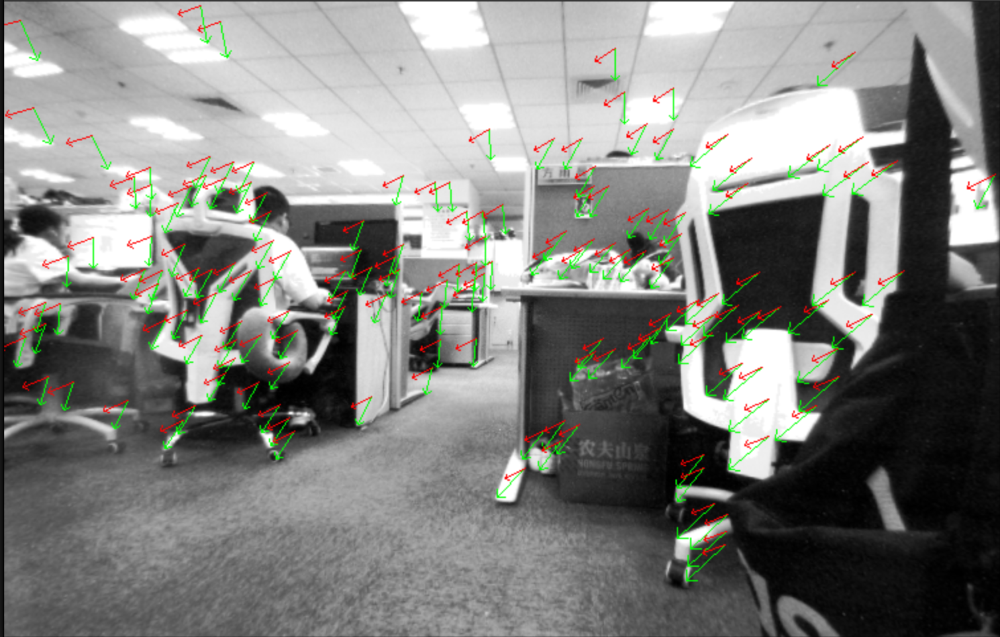
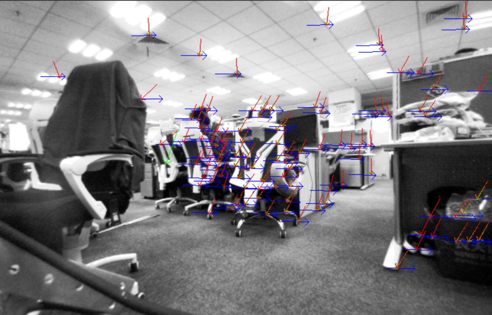

# stereo_ext_opt

This package is used to optimize the **Rotation** of the stereo camera's extrinsic. It is rewritten from [lvio-fusion](https://github.com/jypjypjypjyp/lvio_fusion). Usually, we use RANSAC and the 8-point method for calibration, but those methods are not stable in practical application. To fix this problem, I implemented a non-linear optimization method based on the distance between the matching point and the epipolar line as the cost. This method does not require a calibration board and works in a random environment, also the whole process will be completed quickly.

# How to use

* Modify the [configuration](src/stereo_ext_opt/config/bupt.yaml)
* roslaunch stereo_ext_opt bupt.launch

# Result

### Before optimaztion

### After optimaztion

The green lines show the stereo matchs; 
The red lines show 2-D points re-projected from triangulated landmarks. 
Green lines and red lines almost coincide.(The blue lines represents the epipolar line) 